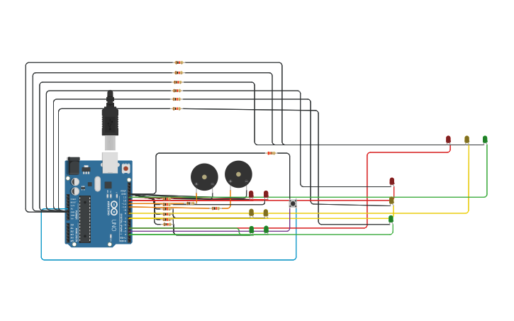

# Dojo1

## integrantes
- Angel Zabala

## Proyecto: Semaforo
Un semaforo para el gobierno de la ciudad

## Funcion principal
Esta funcion se encarga de encender y apagar los leds

pin y pinDos son los dos leds del mismo color que se encienden y apagan a la vez

~~~ C
void encenderApagar(int pin, int pinDos,int tiempo)
{
  encender(pin, pinDos, tiempo);
  apagar(pin, pinDos);
}
~~~

# 🤖 Link al proyecto
- [proyecto] (https://www.tinkercad.com/things/0RNIql7IfcW)
